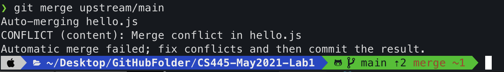
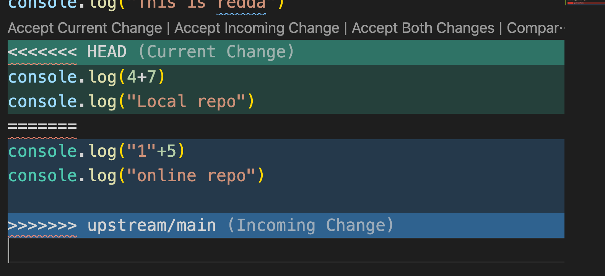
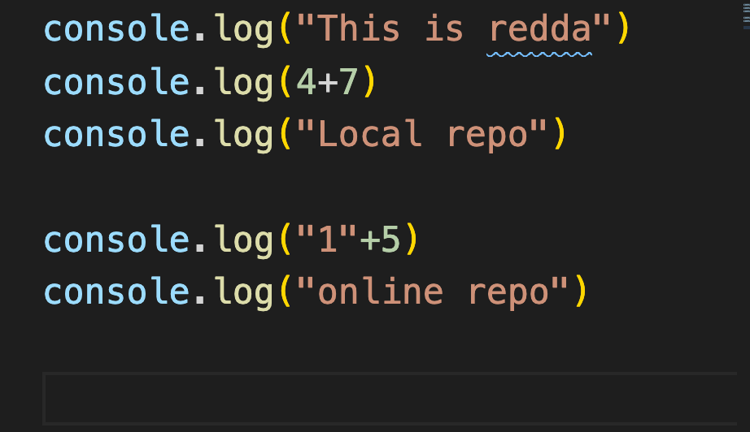

# CS445-May2021-Lab1

### Use this upstream repository to do exercise 3
### remote -v
 
### git merge
 
### git fetch
  
  ### conflict
 
### conflict happen between remote and local repo

### conflict solved 
 

